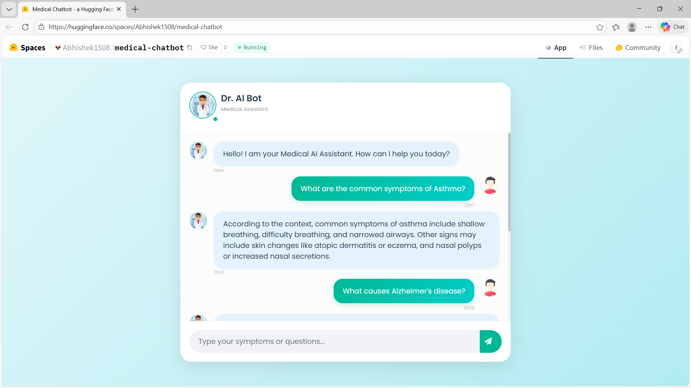
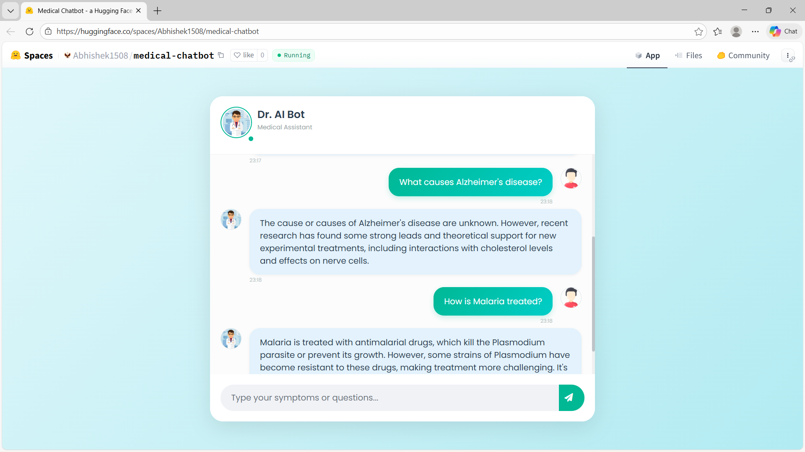
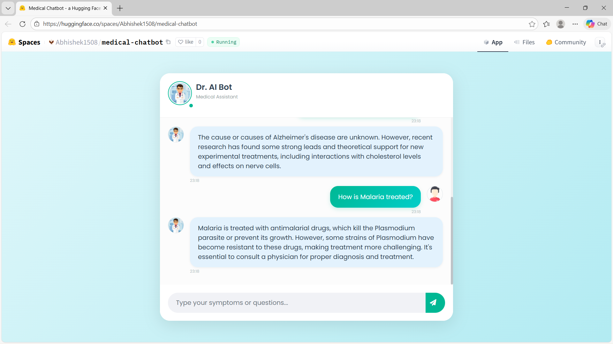

# Medical-Chatbot-with-LLMs-LangChain-Pinecone-Groq-HuggingFace

# 🚀 [Click Here to Try the Live App](https://huggingface.co/spaces/Abhishek1508/medical-chatbot)

---

## 📸 Live Demo & Capabilities
The bot is trained on the **Gale Encyclopedia of Medicine (2nd Edition)** and leverages RAG (Retrieval Augmented Generation) to provide accurate, context-aware answers without hallucinating.

### 1. Symptom Identification
*Accurately lists specific symptoms based on clinical data.*


### 2. Complex Disease Explanations
*Synthesizes detailed explanations for complex conditions.*


### 3. Treatment & Pharmacology
*Retrieves specific drug names and treatment protocols.*


---

## 🛠 Techstack Used
* **LLM:** Groq (Llama 3.3)
* **Orchestration:** LangChain
* **Vector Database:** Pinecone
* **Backend:** Flask
* **Deployment:** Hugging Face Spaces (Docker)
* **Language:** Python

---

## 💻 How to run locally?

### Step 1: Clone the repository
```bash
git clone [https://huggingface.co/spaces/Abhishek1508/medical-chatbot](https://huggingface.co/spaces/Abhishek1508/medical-chatbot)

```

### Step 2: Create a conda environment

```bash
conda create -n medibot python=3.10 -y
conda activate medibot

```

### Step 3: Install the requirements

```bash
pip install -r requirements.txt

```

### Step 4: Configure Credentials

Create a `.env` file in the root directory and add your API keys:

```bash
PINECONE_API_KEY = "xxxxxxxxxxxxxxxxxxxxxxxxxxxxx"
GROQ_API_KEY = "xxxxxxxxxxxxxxxxxxxxxxxxxxxxx"

```

### Step 5: Store Embeddings

Run the ingestion script to process the PDF and store vectors in Pinecone.

```bash
python store_index.py

```

### Step 6: Run the Application

```bash
python app.py

```

Now, open `localhost:8080` in your browser.

---

## 🐳 Deployment on Hugging Face Spaces (Docker)

### 1. Login to Hugging Face

Create a new Space with the following configuration:

* **Space Name:** medical-chatbot
* **SDK:** Docker

### 2. Dockerfile Configuration

The app uses a lightweight Python 3.9 image. Ensure your `Dockerfile` is in the root:

```dockerfile
# Use Python 3.9 image
FROM python:3.9

# Set the working directory
WORKDIR /code

# Copy requirements and install
COPY ./requirements.txt /code/requirements.txt
RUN pip install --no-cache-dir --upgrade -r /code/requirements.txt

# Copy the rest of the application
COPY . /code

# Set permissions and path
RUN mkdir -p /code/cache && chmod -R 777 /code/cache
ENV TRANSFORMERS_CACHE=/code/cache
ENV PYTHONPATH=/code

# Command to run the application
CMD ["gunicorn", "-b", "0.0.0.0:7860", "app:app"]

```

### 3. Configure Secrets

Go to **Settings > Variables and secrets** in your Space and add:

* `PINECONE_API_KEY`
* `GROQ_API_KEY`

### 4. Push to Deploy

```bash
git add .
git commit -m "Deploy to HF Spaces"
git push

```

The Space will automatically build the Docker image and start the application on port `7860`.

